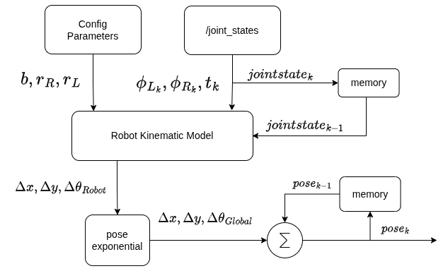

# Considerations

Discussion:
- drivers report information to ``/joint_states`` topic which gives 
    - name of joints
    - position
    - velocites
    - effort
    - timestamp
- Handling time stamps and synchronization for odometry computation in a mobile robot:  
    - Encoder data from left and right wheels, which may arrive at different time stamps.
    -  Ideally, the driver should provide all wheel states with a single time stamp, representing the acquisition time. If perfect synchronization is not possible, the driver should use a common time base and estimate missing values using interpolation (linear, cubic, etc.) or averaging from previous samples.
    - The odometry output should use the controller’s acquisition time stamp (sample time), not the time when the algorithm publishes the data. This ensures the odometry reflects the robot’s actual position at the time of measurement, even if computation and transport introduce delays.

        Key Principle: Always propagate the original acquisition time stamp through the system for accuracy.

- Odometry Based on Deltas:  
    Odometry integrates velocity deltas over time to compute position.
    Requires maintaining a previous state (last sample) to compute the next delta.

- Initial State Options:
    - Option 1:  
        Use a predefined initial pose from configuration (e.g., X, Y, θ from a YAML file or constants).
    - Option 2:  
        Start at origin (0,0,0) and compute deltas from there. For the first sample, you cannot compute a delta because there’s no previous state. So:
        - Store the first sample as the reference.
        - Begin computation from the second sample onward.

- Configuration Source:
    Configurations come from:
    - ROS parameters or YAML files.
    - Static constants in code (if not using ROS).  
    These values are based on mechanical drawings and calibration routines (e.g., wheel radius, encoder counts).  
    Calibration ensures accuracy (left/right wheel radius may differ slightly).

## Scope of Design
- What does my design need to cover? 
- Which is the scope?
- What are input and output of the system?
- Which are the inputs of the system?
---

- Design should cover generalized kinematic configurations for following:
    1. Differential drive
    2. Ackermann drive
    3. Omnidirectional drive
    4. Swerve drive
- Inputs
    - info from `/joint_states`
    - kinematic configuration as ROS2 parameters or config.yaml
        - radius of wheel
        - baseline or wheel seperation
        - specific case of generic configs like ackermann (tricycle, FWD, RWD) etc.
    - Twist (linear and angular robot velocities)
- Outputs
    - synchronous processing of info from /joint_states
    - latency/jitter from input to be considered if computation is slower
    - Wheel odometry to `/odom`
        - pose (position and orientation quaternion), twist and covariance of `base_link` in `odom` frame
        - timestamp
        - there are multiple
        - covariance analysis
            - out of the scope for this project
            - usually analysed on data from whole experiement rosbag
            - take as input parameter and plug into output
            - all non-prinpical diagonal values are zero
            -
    - Transform between frames `odom -> base_link` to `/tf`
        - pose info: position + orientation
        - timestamp
        - computationally expensive so can be published in low freq
        - not isolated hence may be need to update whole sub-tree 
        - not recommended or optional output
---
## Block Diagram

---

## Components
- Which are the individual components that I need to implement?
- What are the responsibilities? 
- How do they talk to each other?
- Is my design synchronous or asynchronous?
- States
    - How do we keep state?
    - Is the algorithm stateful or stateless?
---
The overall design is asynchronous and distributed by virtue of ROS2. There may be synchronous components like ROS2 service calls, Parameter server, etc. which are blocking.

#### <u> Non-ROS Components:</u>
The design of non-ROS components are asynchronous in nature.
1. **FK implementation**
    - converts required robot linear and angular velocity into wheel velocities which are input to motor control hardware.
2. **Wheel Odometry**
    - includes implementation of **pose exponential** for pose estimation

#### <u> ROS components</u>:
There may be synchronous components like service calls.
1. Kinematic Topic Subscriber node:
    - Synchronous callback
    - reads from `\joint_states` topic
    - Publisher inside same callback
    - Synchronous callback
    - publish odometry to `\odom` topic
2. TF is optional
    - need different callback/ thread
    - can be implemented using timer
    - adjust frequency

#### <u> Statefulness of Algorithms </u>
1. **Pose estimation** is inherently stateful as the algorithm tries to determine the robot's position and orientation over time by using past states, as 
$$pose_t​=pose_{t−1}​+\Delta pose$$
2. keep track of previous `/joint_states`
3. **Inverse kinematics (IK)** and **Forward kinematics (FK)** equations are generally stateless unless numerical iterative methods (which use intermediate states) are employed to achieve solution.

    In a ROS node, the state is maintained by storing current pose, velocity, cov, etc as class member variables.

---

## Testing
- How can I test every line of code?
---
1. **Static Analysis Tools** helps test every line of code at least for:
    - Formatting
    - Styling: check code for style violations and probelematic patterns
    - Common bugs: find potential bugs and errors like null ptr dereferences, memory leaks, undefined behavior, etc.

2. **Unit Testing**
    - Use GTest to test every single functions/methods for expected outcomes and expected errors/exceptions.

3. **ROS Unit Testing**
    - To test whether ROS interfaces are communicating or connected as expected
    - might need to check in insolation as well
4. **Integration Testing**
    - on sim platform like gazebo
    - or using rosbag data

---
## Dependencies

- Which are my dependencies?  
- Why do I depend on them?  
- Is it worth implementing them on my own?

---

Following are dependencies:
1. `Eigen3` library
    - a header-only library, so no linking hassle: just #include the headers
    - handles vectors, matrices, linear algebra, transformations, and even quaternions, which makes it perfect for FK, IK, and pose exponential calculations in robotics.
    - Why: 
        - manual implementation in C++ is error-prone
        - `Eigen3` is heavily optmized
        - Compatibility to ROS/Gazebo: messages, TFs, gazebo expect Eigen3 types, so need to put effort on conversion to Eigen3 types as well.
    - No manual implementation:
        - Eigen3 is faster, safer and future-proof.
        - Save extra effort on developing and testing own math library.
2. ROS
    - `rclcpp`
    - `ament`

3. Testing
    - `GTest`
    - `GMock`

***

## Bottlenecks
- Which part is the riskiest part in the entire design?  
`you can think of the riskiest as the part of the system that you know less about.`

- Which is the complexity of the algorithm? Time and memory.
---
- benchmark the algorithm 
- comparative analysis against other available wheeel odom algorithms/packages