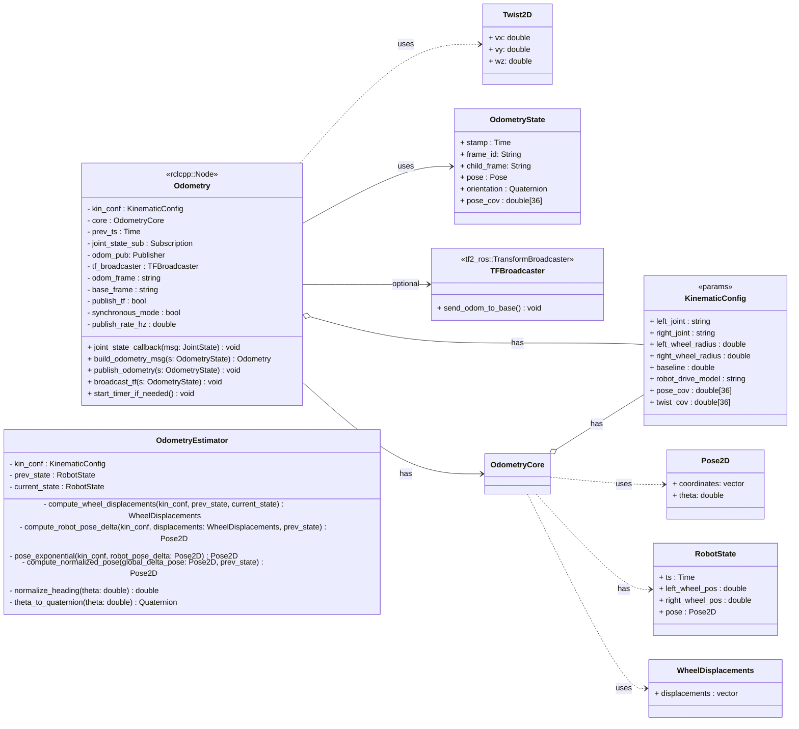

```mermaid
classDiagram
direction LR

class KinematicConfig {
  <<params>>
  + left_joint : string
  + right_joint : string
  + left_wheel_radius : double
  + right_wheel_radius : double
  + baseline : double
  + robot_drive_model : string
  + pose_cov : double[36]
  + twist_cov : double[36]
}

class Odometry {
  <<rclcpp::Node>>
  - kin_conf : KinematicConfig
  - core : OdometryCore
  - prev_ts : Time
  - joint_state_sub : Subscription<JointState>
  - odom_pub: Publisher<Odometry>
  - tf_broadcaster : TFBroadcaster
  - odom_frame : string
  - base_frame : string
  - publish_tf : bool
  - synchronous_mode : bool
  - publish_rate_hz : double
  + joint_state_callback(msg: JointState) void
  + build_odometry_msg(s: OdometryState) Odometry
  + publish_odometry(s: OdometryState) void
  + broadcast_tf(s: OdometryState) void
  + start_timer_if_needed() void
}

class OdometryEstimator {
  - kin_conf : KinematicConfig
  - prev_state : RobotState
  - current_state : RobotState

  - compute_wheel_displacements(kin_conf, prev_state, current_state) WheelDisplacements
  - compute_robot_pose_delta(kin_conf, displacements: WheelDisplacements, prev_state) Pose2D
  - pose_exponential(kin_conf, robot_pose_delta: Pose2D) Pose2D
  - compute_normalized_pose(global_delta_pose: Pose2D, prev_state) Pose2D

  - normalize_heading(theta: double) double
  - theta_to_quaternion(theta: double) Quaternion
}

class WheelDisplacements {
    + displacements : vector<double>
}


class Pose2D {
    + coordinates: vector<double>
    + theta: double
}

class Twist2D {
    + vx: double
    + vy: double
    + wz: double
}

class RobotState {
    + ts : Time
    + left_wheel_pos : double
    + right_wheel_pos : double
    + pose : Pose2D
}

class OdometryState {
  + stamp : Time
  + frame_id: String
  + child_frame: String
  + pose : Pose
  + orientation : Quaternion
  + pose_cov : double[36]
}

class TFBroadcaster {
  <<tf2_ros::TransformBroadcaster>>
  + send_odom_to_base() void
}

Odometry --> OdometryCore : has
Odometry --> OdometryState : uses
Odometry ..> Twist2D : uses
Odometry o-- KinematicConfig : has

OdometryCore o-- KinematicConfig : has
OdometryCore ..> Pose2D : uses
OdometryCore ..> RobotState : has
OdometryCore ..> WheelDisplacements : uses
Odometry --> TFBroadcaster : optional
```
